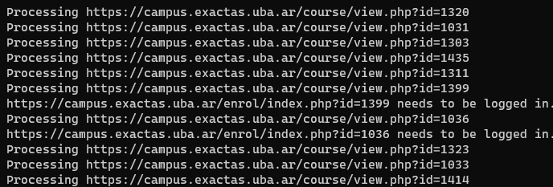

# Scrapuba

[ES/EN]

La versión en inglés de este README estará disponible pronto.

> “The illiterate of the 21st century will not be those who cannot read and write, but those who cannot learn, unlearn and relearn.”  
– Alvin Toffler

> “To develop a complete mind: study the science of art; study the art of science. Learn how to see. Realize that everything connects to everything else.”  
– Leonardo da Vinci

>”Educating the masses was intended only to improve the relationship between the top and the bottom of society. Not for changing the nature of the relationship.”  
– John Ralston Paul, “Voltaire’s Bastards”

Scrapuba es un "bot" para descargar el material publico disponible en el [Campus Virtual de la Facultad de Ciencias Exactas de la UBA]([https://campus.exactas.uba.ar](https://campus.exactas.uba.ar/)).

Esta es la primera versión *funcional* del bot. Por mis intereses personales, el material que descargo es el del departamento de computación, pero idealmente esto podría ser configurable en próximas versiones. Por el momento si se desea descargar el material de otro departamento, se deberá cambiar la URL dentro del código.

**Disclaimer**: Esperen inestabilidad, la plataforma misma del campus es inestable. Si el bot no termina de correr al 100% la primera vez, try again. Si el problema esta en el código, abrime un issue! De ese modo puedo solucionar el inconveniente y robustecer la automatizacion.

- [Naturaleza](#naturaleza)
  * [Highlights](#highlights)
- [Scrapuba NO es esto](#scrapuba-no-es-esto)
- [Instrucciones](#instrucciones)
  * [Requisitos](#requisitos)
  * [Instalacion](#instalacion)
  * [Uso](#uso)
- [Proximos pasos](#proximos-pasos)
- [Quiero colaborar](#quiero-colaborar)
- [Motivaciones](#motivaciones)
- [FAQs](#faqs)
- [License](#license)

## Naturaleza

Esta primera versión es capaz de:

- Recorrer el listado de años y períodos de cada año, recolectando los nombres de las asignaturas  y el link hacia las mismas. El paginado es tenido en cuenta para que no queden asignaturas fuera.
Archivo encargado: `index.js`
- Con la información anterior, el próximo paso es entrar en cada asignatura y recolectar el título y el link de cada tab disponible en dicha asignatura. 
Algunas asignaturas si bien nos permiten entrar a su campus, requieren autenticación por lo que solamente nos van a mostrar el tab de "Inicio". 
Archivo encargado: `subjects.js`

> La información generada por los dos pasos anteriores están guardadas en el archivo `data/crawled.json` (actualizado al día 2020-06-22)

- El tercer paso que era el objetivo de esta primera versión es leer el archivo `crawled.json` y recorrer materia por materia, tab por tab en busca de la descarga de los materiales disponibles (y los descarga si los hay en el path `downloads/${año}/${materia}/${id}`).
Archivo encargado: `download.js`

En este tercer paso vale hacer una aclaración sobre los tipos de descarga con los que me topé en el campus. Esencialmente hay dos tipos de descargas:

1) Descargas de "carpetas de material", las cuales clickeamos el link y nos devuelven la carpeta con el material comprimido. 
Estas descargas de carpetas son las que busca el bot en esta versión. Si se quiere, también se pueden descargar los materiales por separado, pero hay una limitación técnica de Puppeteer en cuanto a los archivos PDF, por lo que esto quedará para el futuro.

2) Descargas de archivos sueltos, en varios formatos que no hacen al caso. Dado que Puppeteer tiene limitaciones técnicas en cuanto a la lectura, navegación hacia y descarga de archivos PDF, este tipo de descargas van a ser implementados en el futuro.
Lo que se puede hacer fácilmente a corto plazo por lo menos es crawlear los links de estos materiales para tenerlos "a mano", independientemente de que tipo de archivo sean.

Nota: Hay algunos workarounds de Puppeteer en los cuales interceptando el request y haciendolo a mano se puede descargar el archivo PDF deseado. No es scope de esta version implementarlos, no me resultaron tan estables los que probé.

Referencias Puppeteer ↔ pdf:

- [https://github.com/puppeteer/puppeteer/issues/299](https://github.com/puppeteer/puppeteer/issues/299)

### Highlights



## Scrapuba NO es esto

Scrapuba NO es **nada** de lo siguiente, y cualquier uso del mismo para lograrlo es estrictamente anti ético y potencialmente ilegal.

- Una herramienta para perpetrar DDoS o para desestabilizar el sitio.
- Una herramienta para obtener información de docentes y/o alumnos de las cátedras.
- Una herramienta para obtener plataformas de comunicación de las cursadas entre los alumnos y los responsables de la universidad.

Debido a la naturaleza automática de Puppeteer, es menester que haya delays entre las acciones en el sitio para no caer en situaciones del primer punto nombrado anteriormente.

## Instrucciones

### Requisitos

Node v12.18.1

### Instalacion

```bash
git clone https://github.com/lzok/scrapuba.git
cd scrapuba
npm i
```

### Uso

```bash
# Ya tenemos los datos necesarios en el archivo crawled.json asi que
# podemos ir directo a descargar material.
npm run download
```

## Proximos pasos

- Refactorizar código para centralizar los selectores usados y usarlos como constantes. También hay código repetido que se puede centralizar en funciones comunes.
No me gusta la cantidad de `for` que hay, pero era la forma rápida de *get the thing working right now.*
- Agregar linters y formateador de código. En la pc que hice este proyecto no tengo nada configurado.
- Generar una serie de scripts por si se quisiera ejecutar el proceso completo de una sola vez, o bien solamente la parte de descargas.
- ~~Cambiar los `console.log` por Winston como sistema de logging.~~
- Hacer el error handling correspondiente.
- Añadir opción de loguearse en caso de tener cuenta en el campus? Al ser automático pongo en duda proveer credenciales.
- Permitir configuraciones externas como pueden ser arrancar el bot en modo headless, cambiar la ruta de descargas por default, etc.
- Dadas las limitaciones técnicas mencionadas de Puppeteer, guardar en un archivo JSON o de naturaleza similar todos los links que se correspondan con descargas de materiales individuales. El selector de esto ya está disponible.
- Resolver las limitaciones técnicas de Puppeteer con algún workaround que sea **estable** para poder descargar archivos pdf individuales. En los issues de Github mencionan unos cuantos.
- Detectar bibliografias y/o materiales de referencia para poder guardarlos.

## Quiero colaborar

Genial!

Podés tomar cualquiera de los puntos listados en **Próximos pasos** y mandar un pr mostrando la solución para mergearlo acá.

Si ningún punto te interesa pero tenés más ideas para sumar, son bienvenidas. Contactate conmigo que las charlamos para ponerlas en marcha.

## Motivaciones

Probar Puppeteer y ver qué enseñan en CS en la UBA.

Conclusión Puppeteer: Sencillo de usar, súper imperativo (🤢). Muy recomendado para tareas sencillas; se vuelve engorroso con usos más complejos.
La documentación de Puppeteer está muy bien lograda y completa.

## FAQs

- *Eh pero podrías haberlo hecho con X que es rapidísimo y scrapea como un fórmula 1 y sabe descargar pdfs sin workarounds y encima arregla las inconsistencias del sitio y te sirve café mientras laburas.*

🤐

## License
**MIT LICENSE**

La licencia completa la podes chequear [aca](https://github.com/Lzok/scrapuba/blob/master/LICENSE)
